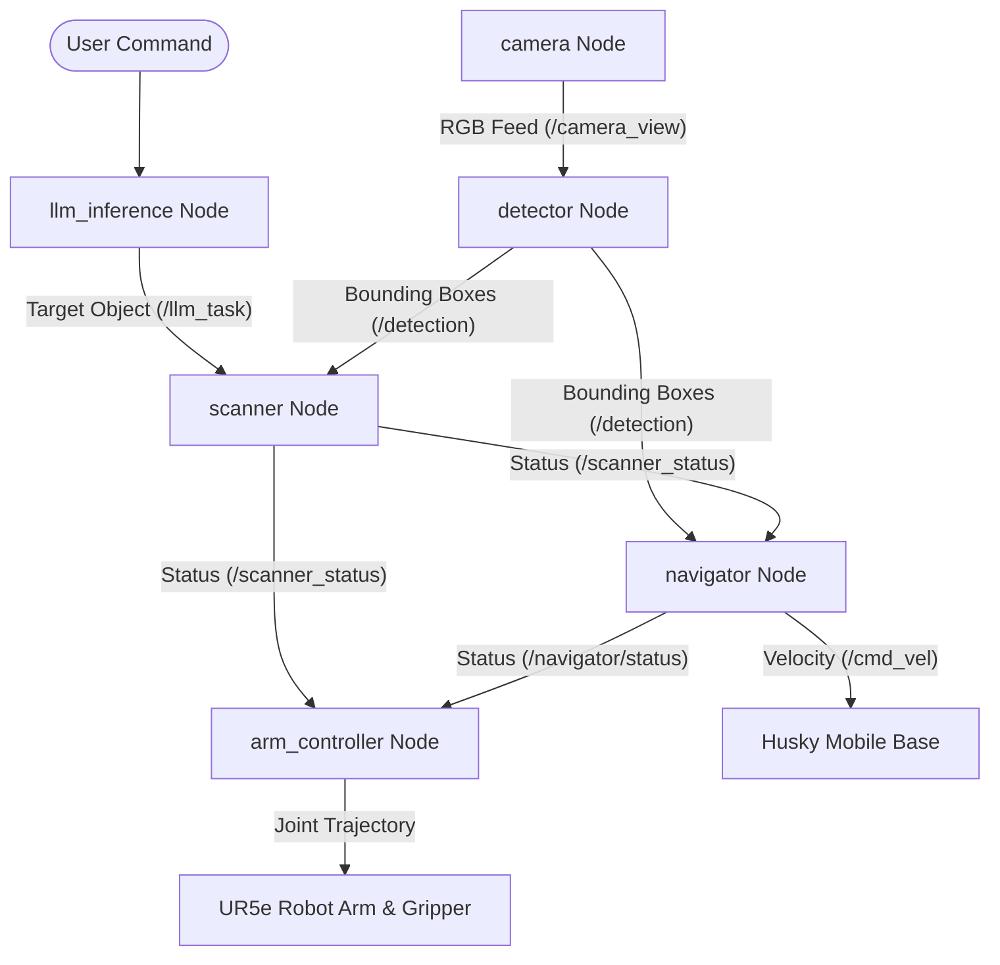

# Natural Language Controlled Mobile Manipulator

This project controls a mobile manipulator robot (mobile base + robot arm) in a simulation environment using natural language commands. The system is built on **ROS2 Humble** and **Gazebo Ignition (Fortress)**.

A user can type a command (for example: *"Pick up the coke can"*). The local LLM processes this command, YOLOv8 detects the target, the robot drives to it otonomously, and the arm picks it up.

---

## 🏗️ System Architecture & How It Works

The system consists of several ROS2 nodes that communicate with each other. Here is the workflow:



### 1. LLM Layer (`llm_inference.py`, `prompt.py`)
- **What it does:** Understands the user's natural language command.
- **How it works:** It sends the text to a local **Ollama (Llama 3.2: 1B)** model. The model converts the command into a simple JSON format (e.g., `{"task": "pick_and_place", "object": "coke"}`). The node then publishes the object name (like `coke` or `box`) to the `/llm_task` topic.

### 2. Perception Layer (`camera.py`, `detection.py`, `scanner.py`)
- **What it does:** Finds target objects in the 3D environment.
- **How it works:**
  - `camera.py` streams the RGB feed from the robot's wrist camera to the `/camera_view` topic.
  - `detection.py` uses a custom-trained **YOLOv8** model to detect target objects (coke can or box) in real-time and publishes their pixel coordinates.
  - `scanner.py` rotates the arm's base joint (`shoulder_pan_joint`) to look around. When it finds the target object from the YOLO detection feed, it stops moving and locks the arm.

### 3. Navigation Layer (`navigator.py`)
- **What it does:** Drives the robot to the target object.
- **How it works:** When the scanner locks onto the target, the navigator starts. It uses a **visual servoing** method: it controls the Husky's forward speed (`linear.x`) and turning speed (`angular.z`) to center the object in the camera view. It reads depth information from the RealSense camera and stops exactly `0.82m` in front of the target.

### 4. Manipulation Layer (`arm_controller.py`)
- **What it does:** Reaches out, aligns, and picks up the target.
- **How it works:** 
  - The arm moves to a top-down position (`REACH_JOINTS`) above the table.
  - It aligns the gripper with the target using a closed-loop P-controller based on camera coordinates.
  - Once aligned, it moves straight down (`DESCENDING`) to the target.
  - The Robotiq gripper closes to grab the object, and the arm lifts it back up to its home position.

---

## 🚀 How to Install and Run

### 1. Prerequisites
- **ROS2 Humble** and **Gazebo Ignition (Fortress)** must be installed on your Ubuntu system.
- Install **Ollama** and download the Llama 3.2 model:
  ```bash
  ollama run llama3.2:1b
  ```
- Install the required Python packages:
  ```bash
  pip install ultralytics opencv-python numpy
  ```

### 2. Clearpath Simulator & Setup
To simulate the Husky A200 base, UR5e arm, and Robotiq gripper, install the Clearpath packages:

- **Add the repository and install packages:**
  ```bash
  wget https://packages.clearpathrobotics.com/public.key -O - | sudo apt-key add -
  sudo sh -c 'echo "deb https://packages.clearpathrobotics.com/stable/ubuntu $(lsb_release -cs) main" > /etc/apt/sources.list.d/clearpath-latest.list'
  sudo apt update
  sudo apt install ros-humble-clearpath-simulator ros-humble-clearpath-desktop
  sudo apt install ros-humble-clearpath-manipulators ros-humble-clearpath-sensors
  ```

- **Set up the robot configuration:**
  1. Create the config folder:
     ```bash
     mkdir -p ~/clearpath
     ```
  2. Copy the configuration file from this repository:
     ```bash
     cp ~/ros2_ws/robot.yaml ~/clearpath/robot.yaml
     ```
  3. Generate the URDF and launch files:
     ```bash
     source /opt/ros/humble/setup.bash
     ros2 run clearpath_generator_common generate_description -s ~/clearpath/
     ros2 run clearpath_generator_common generate_bash -s ~/clearpath/
     ```

- **Add Gazebo Environment Variables:**
  Add these lines to the end of your `~/.bashrc` file so Gazebo can find the custom world files:
  ```bash
  export GZ_SIM_RESOURCE_PATH=$GZ_SIM_RESOURCE_PATH:~/ros2_ws/src/llm_robot/worlds
  export GZ_SIM_RESOURCE_PATH=$GZ_SIM_RESOURCE_PATH:~/ros2_ws/src/llm_robot/worlds/models
  export IGN_GAZEBO_RESOURCE_PATH=~/ros2_ws/src/llm_robot/worlds:~/ros2_ws/src/llm_robot/worlds/models:$IGN_GAZEBO_RESOURCE_PATH
  ```
  Update your terminal configuration:
  ```bash
  source ~/.bashrc
  ```

### 3. Build the Package
Go to your ROS2 workspace and compile the project:
```bash
cd ~/ros2_ws
colcon build --packages-select llm_robot
source install/setup.bash
```

### 4. Running the System

1. **Launch the Simulation and Nodes:**
   Run the following launch script. It starts the Gazebo simulator, loads the world, spawns the robot, and launches all ROS2 nodes:
   ```bash
   ros2 launch llm_robot simulation.launch.py
   ```

2. **Run the LLM Interface:**
   Open a new terminal, source the workspace, and run the LLM node to start giving commands:
   ```bash
   source ~/ros2_ws/install/setup.bash
   ros2 run llm_robot llm_inference
   ```
   Type your command in English (e.g., *"please grab the coke can"*) and press Enter. The robot will start the search and execution sequence.
