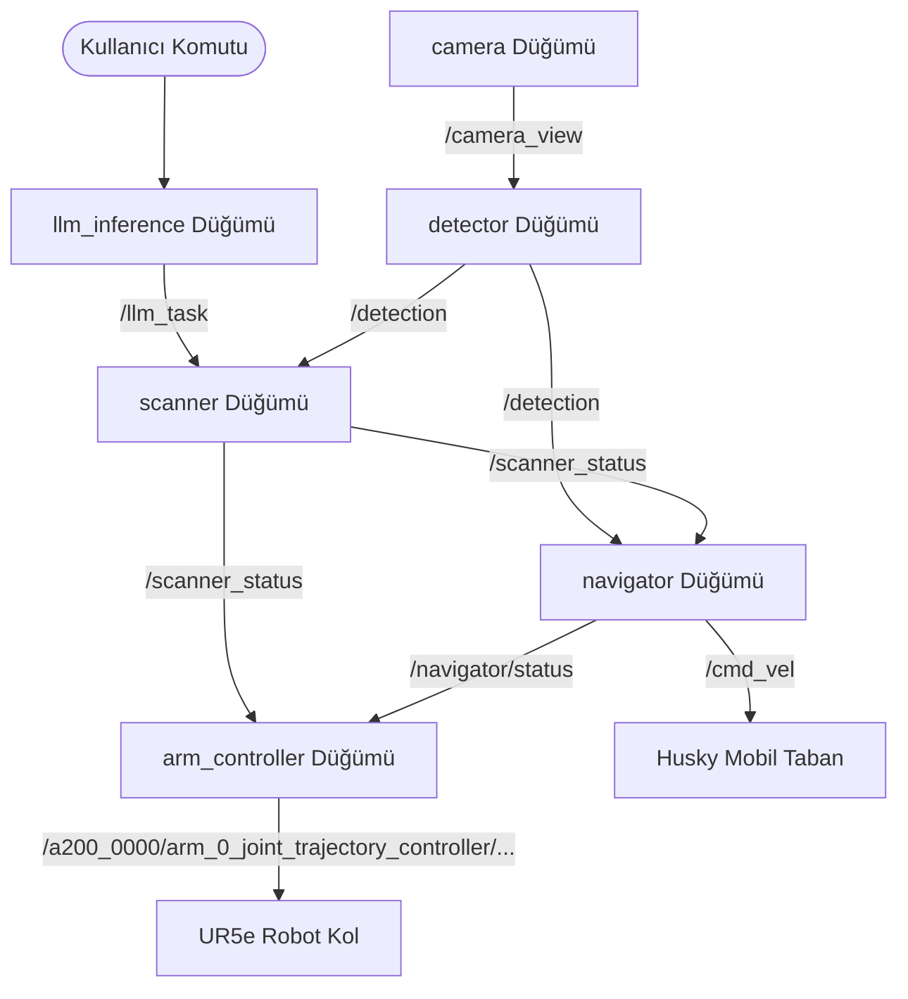

# LLM-Based Natural Language Controlled Mobile Manipulation Robot

Bu proje, **ROS2 Humble** ve **Gazebo Ignition** simülasyon ortamında, doğal dil komutları ile kontrol edilen bir mobil manipülatör (mobil robot ve robot kol) sisteminin geliştirilmesini içerir. Kullanıcının İngilizce veya Türkçe verdiği doğal dil komutları (örn. *"Pick up the coke can and place it on the other table"*) yerel bir LLM tarafından analiz edilir ve robotun otonom olarak nesneyi tespit etmesi, yanına gitmesi ve nesneyi kavraması sağlanır.

---

## 🚀 Proje Bileşenleri & Teknolojiler
*   **ROS2 Sürümü:** ROS2 Humble LTS
*   **Simülasyon Platformu:** Gazebo Ignition (Clearpath Warehouse SDF ortamı)
*   **Mobil Robot:** Clearpath Husky A200
*   **Robot Kol:** Universal Robots UR5e
*   **Tutucu:** Robotiq 2F-85 Gripper
*   **Kamera:** Intel RealSense D435 Depth Camera
*   **Yapay Zeka / LLM:** Ollama (Llama 3.2: 1B)
*   **Nesne Tespiti:** YOLOv8 Custom Model (Coke & Box tespiti için özel eğitilmiş)

---

## 🏗️ Sistem Mimarisi

Sistem, ROS2 topic'leri üzerinden birbirleriyle haberleşen üç temel katmandan ve bağımsız düğümlerden (nodes) oluşur:



### 1. LLM Katmanı (`llm_inference.py`, `prompt.py`)
*   **Görevi:** Kullanıcıdan gelen metinsel komutu işler.
*   **Çalışma Yapısı:** Yerel olarak çalışan `llama3.2:1b` modeli yardımıyla girdiyi yapılandırılmış bir JSON formatına (`{"task": "pick_and_place", "object": "coke"}`) çevirir ve nesne adını `/llm_task` topic'i üzerinden yayınlar.

### 2. Algılama (Perception) Katmanı (`camera.py`, `detection.py`, `scanner.py`)
*   **Görevi:** Çevredeki nesneleri YOLOv8 ile tespit etmek ve robot kolunu hedefe yönlendirmek.
*   **Çalışma Yapısı:**
    *   `camera.py`: Gazebo kamerasından aldığı görüntüleri ROS2 formatında `/camera_view` topic'ine aktarır.
    *   `detection.py`: Özel eğitilmiş YOLOv8 modelini kullanarak nesneleri (coke, box) 30 FPS hızında algılar ve `/detection` topic'ine koordinatları gönderir.
    *   `scanner.py`: `/llm_task` üzerinden gelen hedef nesneye göre robot kolunu (`shoulder_pan` eklemini -1.5 ila +1.5 rad arasında taratarak) döndürür. Nesne tespit edildiğinde kolu kilitler ve `/scanner_status` üzerinden `LOCKED` durumu yayınlar.

### 3. Navigasyon Katmanı (`navigator.py`)
*   **Görevi:** Robotun hedef nesneye otonom olarak yaklaşmasını sağlamak.
*   **Çalışma Yapısı:** Görsel servoing (visual servoing) yöntemiyle açısal ve doğrusal hızları aynı anda yöneterek robotu nesneye yaklaştırır. Depth kamerasından okunan gerçek mesafe bilgisiyle hedef nesneye `0.75m` kala durur ve `/navigator/status` topic'ine `ARRIVED` bilgisini geçer.

### 4. Manipülasyon Katmanı (`arm_controller.py`)
*   **Görevi:** Robot kolunu nesneye ulaştırıp gripper ile kavrama işlemini gerçekleştirmek.
*   **Çalışma Yapısı:** Kapalı çevrim P-kontrolcü kullanarak kolun hizalanmasını (ALIGNING) sağlar, ardından uzanma (REACHING), kavrama (GRIPPING) ve kaldırma (LIFTING) aşamalarını yürütür.

---

## 📂 Dosya Yapısı

```text
ros2_ws/src/llm_robot/
├── launch/
│   └── simulation.launch.py   # Simülasyonu ve ROS2 düğümlerini zaman ayarlı çalıştırır
├── llm_robot/
│   ├── camera.py             # Gazebo kamera görüntüsünü yayınlayan düğüm
│   ├── detection.py          # YOLOv8 nesne tespiti yapan düğüm
│   ├── scanner.py            # Kolu tarama moduna sokup hedefe kilitleyen düğüm
│   ├── navigator.py          # Görsel servoing ile robotu hedefe yaklaştıran düğüm
│   ├── arm_controller.py     # Robot kolunu kontrol eden düğüm (P-kontrolcü)
│   ├── llm_inference.py      # Kullanıcı girdilerini işleyen Ollama arayüzü
│   ├── prompt.py             # LLM sistem prompt'ları ve yapılandırmaları
│   └── best.pt               # YOLOv8 için eğitilmiş ağırlık dosyası
├── worlds/
│   └── my_world.sdf          # Simülasyon dünyası (cafe table, coke, box vb.)
├── package.xml               # ROS2 Paket bağımlılıkları
└── setup.py                  # Düğüm giriş noktaları ve yükleme ayarları
```

---

## 🛠️ Kurulum ve Çalıştırma

### Bağımlılıklar
1.  **ROS2 Humble** ve **Gazebo Ignition (Fortress)** kurulu olmalıdır.
2.  **Ollama** kurulu olmalı ve arka planda `llama3.2:1b` modeli çalışıyor olmalıdır:
    ```bash
    ollama run llama3.2:1b
    ```
3.  Gerekli Python paketlerini kurun:
    ```bash
    pip install ultralytics opencv-python numpy
    ```

### Paketi Derleme
Workspace dizininize gidip derleme işlemini yapın:
```bash
cd ~/ros2_ws
colcon build --packages-select llm_robot
source install/setup.bash
```

### Projeyi Çalıştırma

1.  **Simülasyonu ve Düğümleri Başlatın:**
    Aşağıdaki launch dosyası Gazebo dünyasını açar, kolu varsayılan pozisyonuna getirir ve gerekli tüm ROS2 düğümlerini sırayla başlatır.
    ```bash
    ros2 launch llm_robot simulation.launch.py
    ```

2.  **LLM Arayüzünü Başlatın:**
    Kullanıcıdan terminal üzerinden doğal dil girdisi alabilmek için bu düğümü ayrı bir terminalde çalıştırın:
    ```bash
    ros2 run llm_robot llm_inference
    ```

---

## 🛠️ Karşılaşılan Kritik Sorunlar ve Çözümleri

*   **Depth Kamera NaN Sorunu:** Gazebo dünyasında boş alanlarda ışın yansıması olmadığı ve Gazebo eklentilerinde `.so` uzantıları eksik olduğu için depth verisi NaN dönmekteydi. World dosyası Clearpath `warehouse.sdf` base alınarak güncellendi ve sorun çözüldü.
*   **ROS2 TF Namespace Çakışması:** Clearpath robotunun tüm TF dönüşümleri `/a200_0000/tf` altında yayınlanırken standart dinleyiciler `/tf` aramaktaydı. Launch dosyasında remapping uygulanarak çözüldü.
*   **YOLO Yakın Mesafe Tespiti:** Kamera nesneye çok yaklaştığında modelin nesneyi kaçırması sorunu, simülasyondan çok yakın mesafeli görüntüler toplanıp datasetin genişletilmesi ve YOLOv8 modelinin yeniden eğitilmesiyle giderildi.
*   **Eklem Yön Hatası:** UR5e robot kolunun `shoulder_lift` ekleminin pozitif yönünün yukarı/geri olması sebebiyle kolun ters yöne gitmesi sorunu, yön katsayıları simüle edilerek güncellendi.
